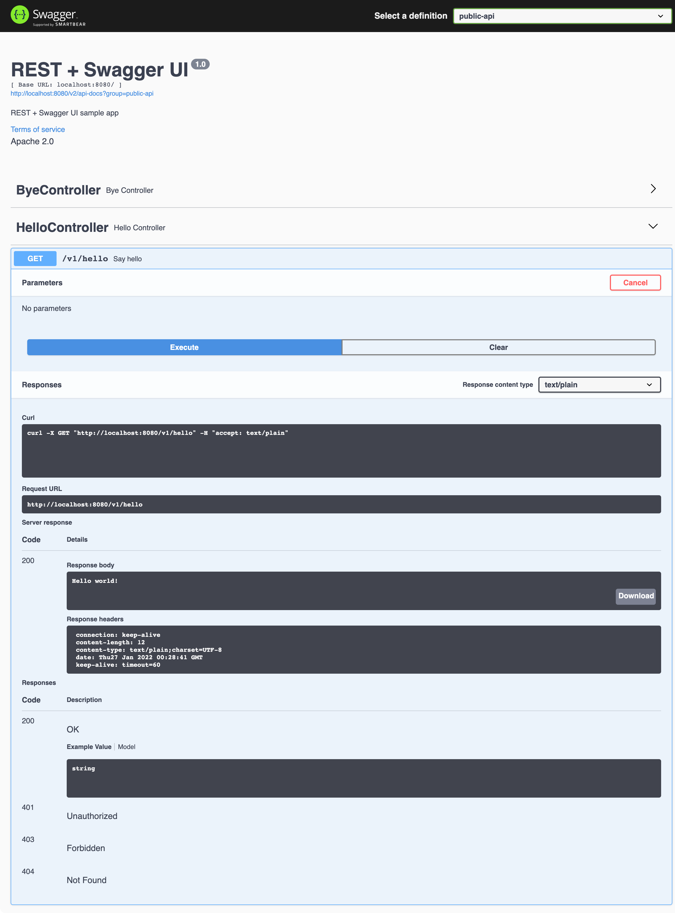
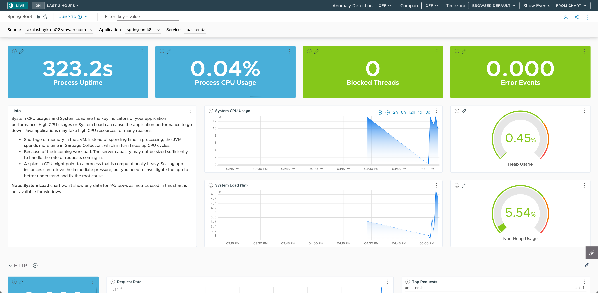
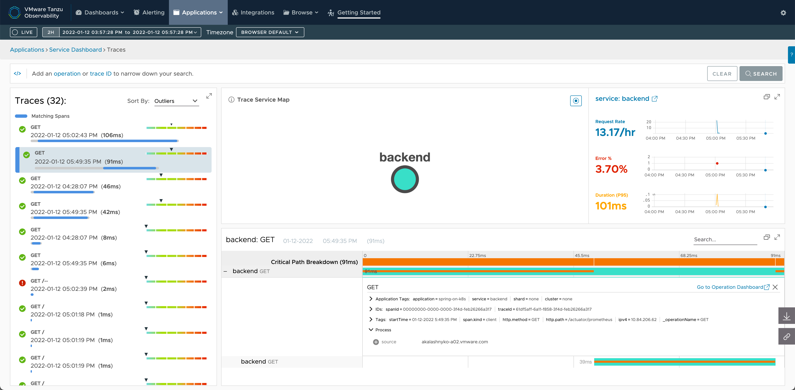

[](https://github.com/AndriyKalashnykov/spring-on-k8s/actions/workflows/test.yml)
[](https://hits.seeyoufarm.com)
[](https://opensource.org/licenses/MIT)
# Running Spring Boot app on Kubernetes

This project describes how to run Spring Boot app on Kubernetes.
You don't actually need to rewrite your app in order to target a K8s
cluster: Spring Boot can run on many platforms, thanks to
the abstraction level it provides.

This app is made of a single REST controller:
```java
@RestController
class HelloController {
    @Value("${app.message:Hello world!}")
    private String message;
  
    @GetMapping(value = "/", produces = MediaType.TEXT_PLAIN_VALUE)
    String greeting() {
        // Just return a simple String.
        return message;
    }
}
```

## Pre-requisites

- [sdkman](https://sdkman.io/install)

    Install and use JDK 17

    ```bash
    sdk install java 17.0.2-tem
    sdk use java 17.0.2-tem
    ```
* [Apache Maven](https://maven.apache.org/install.html)

  Install Apache Maven 3.8.4

    ```bash
    sdk install maven 3.8.4
    sdk use maven 3.8.4
    ```
* [Docker](https://docs.docker.com/engine/install/)
* [Cloud Native Buildpacks](https://buildpacks.io/docs/tools/pack/)
* [curl](https://help.ubidots.com/en/articles/2165289-learn-how-to-install-run-curl-on-windows-macosx-linux)
* [jq](https://github.com/stedolan/jq/wiki/Installation)
* [git](https://git-scm.com/book/en/v2/Getting-Started-Installing-Git)
* [kubectl](https://kubernetes.io/docs/tasks/tools/install-kubectl/)
* [carvel](https://carvel.dev/)
* [Taznu CLI and plugins](https://docs-staging.vmware.com/en/Tanzu-Application-Platform/1.0/tap/GUID-install-general.html#cli-and-plugin) - Optional

### Compiling application

```bash
mvn clean package -Djava.version=17
```

### Running application locally

```bash
mvn clean spring-boot:run -Djava.version=17
```

The app is available at [http://localhost:8080](http://localhost:8080)

```bash
curl localhost:8080/v1/hello
Hello world!

curl localhost:8080/v1/bye
Bye world!
```

#### Application health, configurations etc.

```bash
curl http://localhost:8080/actuator | jq .

{
  "_links": {
    "self": {
      "href": "http://localhost:8080/actuator",
      "templated": false
    },
    "health": {
      "href": "http://localhost:8080/actuator/health",
      "templated": false
    },
    "health-path": {
      "href": "http://localhost:8080/actuator/health/{*path}",
      "templated": true
    },
    "prometheus": {
      "href": "http://localhost:8080/actuator/prometheus",
      "templated": false
    }
  }
}
```

#### Application REST API documentation with Swagger UI

Open Swagger UI page [http://localhost:8080/swagger-ui/](http://localhost:8080/swagger-ui/)



## Creating a Docker image

Our goal is to run this app in a K8s cluster: you first need to package
this app in a Docker image.

### Buildpacks

Use [Cloud Native Buildpacks](https://buildpacks.io) to build & push your Docker image:

```bash 
export DOCKER_LOGIN=andriykalashnykov
export DOCKER_PWD=YOUR-REGISTRY-PASSWORD
mvn clean spring-boot:build-image -Djava.version=17 -Dimage.publish=true -Dimage.name=andriykalashnykov/spring-on-k8s:latest -Ddocker.publishRegistry.username=${DOCKER_LOGIN} -Ddocker.publishRegistry.password=${DOCKER_PWD}
```

### Docker
If you <i>still</i> want to do it with Docker - here's a proper (multistage, non-root, JAR layers, distroless runtime image base, etc.) [`Dockerfile`](https://github.com/AndriyKalashnykov/spring-on-k8s/blob/facebc172dbb9f068167da774b50b41ae3385a82/Dockerfile) you can use.

Run this command to build this image:
```bash
docker build -t andriykalashnykov/spring-on-k8s:latest --build-arg JDK_VENDOR=eclipse-temurin --build-arg JDK_VERSION=17 .
```

You can now push this image to your favorite Docker registry:
```bash
docker push andriykalashnykov/spring-on-k8s:latest
```

## Scanning for [Log4j 2 CVE-2021-44228](https://www.docker.com/blog/apache-log4j-2-cve-2021-44228/) and other vulnerabilities 

```bash
# scan for all CVEs
docker scan andriykalashnykov/spring-on-k8s:latest 
# scan for CVE-2021-44228
docker scan andriykalashnykov/spring-on-k8s:latest  | grep 'Arbitrary Code Execution'
```

### Using workaround to mitigate `Log4j 2 CVE-2021-44228` by creating Docker image with [custom buildpack](https://github.com/alexandreroman/cve-2021-44228-workaround-buildpack)

```bash
pack build andriykalashnykov/spring-on-k8s:latest  -b ghcr.io/alexandreroman/cve-2021-44228-workaround-buildpack -b paketo-buildpacks/java --builder paketobuildpacks/builder:buildpackless-base
```

## Running Docker image

```bash
docker run --rm -p 8080:8080 andriykalashnykov/spring-on-k8s:latest 
```

## Deploying application to Kubernetes

This project includes Kubernetes descriptors, so you can easily deploy
this app to your favorite K8s cluster:

```bash
ytt -f ./k8s | kapp deploy -y --into-ns spring-on-k8s -a spring-on-k8s -f-
```

Using this command, monitor the allocated IP address for this app:
```bash
kubectl -n spring-on-k8s get svc

NAME     TYPE           CLUSTER-IP       EXTERNAL-IP     PORT(S)        AGE
app-lb   LoadBalancer   xx.100.200.204   xx.205.141.26   80:31633/TCP   90s
```

At some point, you should see an IP address under the column `EXTERNAL-IP`.

If you hit this address, you will get a greeting message from the app:

```bash
curl $(kubectl -n spring-on-k8s get svc app | sed -n '2 p' | awk '{print $4}')

Hello Kubernetes!
```

## Undeploy application from Kubernetes

```bash
kapp delete -a spring-on-k8s --yes
```

## Configure VMware Tanzu Observability (Wavefront)

Wavefront for Spring Boot allows you to quickly configure your
environment, so Spring Boot components send metrics, histograms,
and traces/spans to the Wavefront service, for more details see
how to [examine Spring Boot data in Wavefront dashboards and charts](https://docs.wavefront.com/wavefront_springboot.html#prerequisites-for-wavefront-spring-boot-starter)

### Sending Data From Spring Boot Into Wavefront

You can send data from your Spring Boot applications into Wavefront using the Wavefront for Spring Boot Starter 
(all users) or the Wavefront Spring Boot integration (Wavefront customers and trial users).

* **Freemium** :  All users can run the Spring Boot Starter with the default settings to view their data in the Wavefront Freemium instance. Certain limitations apply, for example, alerts are not available, but you don’t have to sign up.
* **Wavefront Customer or Trial User** : Wavefront customers or trial users can modify the default Wavefront Spring Boot Starter to send data to their cluster. [You can sign up for a free 30-day trial here](https://tanzu.vmware.com/observability)

#### Sending Data From Spring Boot Into Wavefront - Freemium

To configure `Freeminum` modify [application.yml](https://github.com/AndriyKalashnykov/spring-on-k8s/blob/2d109fbb2ea2a5c3c4a99a55c6daa9c8700e78f0/src/main/resources/application.yml)
by specifying `freemium-account : true`, setting `name` of the overarching application and current `service` name in particular.

```yaml
wavefront:
  freemium-account: true
  application:
    name: spring-on-k8s
    service: backend
```

#### Sending Data From Spring Boot Into Wavefront - Wavefront Customer or Trial User

To configure `Wavefront Customer or Trial User` modify [application.yml](https://github.com/AndriyKalashnykov/spring-on-k8s/blob/2d109fbb2ea2a5c3c4a99a55c6daa9c8700e78f0/src/main/resources/application.yml)
by specifying `freemium-account : false` and providing `uri` and `api-token` of the Wavefront instance.

```yaml
wavefront:
  freemium-account: false
  application:
    name: spring-on-k8s
    service: backend

management:
  metrics:
    export:
      wavefront:
        api-token: "$API_Token"
        uri: "$wavefront_instance"
```

We also need to configure Wavefront dependencies based on how you want to send data to Wavefront. Two options are available 
`Spring Cloud Sleuth` and `OpenTracing`.

#### Sending data to `Wavefront` with `Spring Cloud Sleuth`

Modfy Maven project file [`pom.xml`](https://github.com/AndriyKalashnykov/spring-on-k8s/blob/831fc8364ab39b8eacb854aa18b51ca8ba2ff704/pom.xml)

```xml
<dependencyManagement>
  <dependencies>
    <dependency>
      <groupId>com.wavefront</groupId>
      <artifactId>wavefront-spring-boot-bom</artifactId>
      <version>2.2.0</version>
      <type>pom</type>
      <scope>import</scope>
    </dependency>
    
    <dependency>
      <groupId>org.springframework.cloud</groupId>
      <artifactId>spring-cloud-dependencies</artifactId>
      <version>2020.0.4</version>
      <type>pom</type>
      <scope>import</scope>
    </dependency>
  </dependencies>
</dependencyManagement>

<dependencies>
  <dependency>
    <groupId>com.wavefront</groupId>
    <artifactId>wavefront-spring-boot-starter</artifactId>
  </dependency>                   
  <dependency>
    <groupId>org.springframework.cloud</groupId>
    <artifactId>spring-cloud-starter-sleuth</artifactId>
  </dependency>
</dependencies>
```

#### Sending data to `Wavefront` with `OpenTracing`

Modfy Maven project file [`pom.xml`](https://github.com/AndriyKalashnykov/spring-on-k8s/blob/831fc8364ab39b8eacb854aa18b51ca8ba2ff704/pom.xml)

```xml
<dependencyManagement>
  <dependencies>
    <dependency>
      <groupId>com.wavefront</groupId>
      <artifactId>wavefront-spring-boot-bom</artifactId>
      <version>2.2.0</version>
      <type>pom</type>
      <scope>import</scope>
    </dependency>
  </dependencies>
</dependencyManagement>

<dependencies>
  <dependency>
    <groupId>com.wavefront</groupId>
    <artifactId>wavefront-spring-boot-starter</artifactId>
  </dependency>
  
  <dependency>
    <groupId>io.opentracing.contrib</groupId>
    <artifactId>opentracing-spring-cloud-starter</artifactId>
    <version>0.5.9</version>
  </dependency>
</dependencies>
```

Now you can run the project and observe link to the Wavefront dashboard:

```bash
mvn clean package

[INFO] Scanning for projects...
  .   ____          _            __ _ _
 /\\ / ___'_ __ _ _(_)_ __  __ _ \ \ \ \
( ( )\___ | '_ | '_| | '_ \/ _` | \ \ \ \
 \\/  ___)| |_)| | | | | || (_| |  ) ) ) )
  '  |____| .__|_| |_|_| |_\__, | / / / /
 =========|_|==============|___/=/_/_/_/
 :: Spring Boot ::                (v2.5.5)

2022-01-12 Wed 16:28:04.185 INFO  59841 [    main] com.vmware.demos.springonk8s.ApplicationTests:55 : Starting ApplicationTests using Java 17.0.1 on akalashnyko-a02.vmware.com with PID 59841 (started by akalashnykov in /Users/akalashnykov/projects/spring-on-k8s)
2022-01-12 Wed 16:28:04.186 INFO  59841 [    main] com.vmware.demos.springonk8s.ApplicationTests:659 : No active profile set, falling back to default profiles: default
2022-01-12 Wed 16:28:04.820 INFO  59841 [    main] org.springframework.cloud.context.scope.GenericScope:283 : BeanFactory id=964ae347-b9e4-313e-8d67-3ac7de89d489
2022-01-12 Wed 16:28:05.287 INFO  59841 [    main] org.springframework.boot.web.embedded.tomcat.TomcatWebServer:108 : Tomcat initialized with port(s): 0 (http)
2022-01-12 Wed 16:28:05.295 INFO  59841 [    main] org.apache.catalina.core.StandardService:173 : Starting service [Tomcat]
2022-01-12 Wed 16:28:05.296 INFO  59841 [    main] org.apache.catalina.core.StandardEngine:173 : Starting Servlet engine: [Apache Tomcat/9.0.53]
2022-01-12 Wed 16:28:05.391 INFO  59841 [    main] org.apache.catalina.core.ContainerBase.[Tomcat].[localhost].[/]:173 : Initializing Spring embedded WebApplicationContext
2022-01-12 Wed 16:28:05.391 INFO  59841 [    main] org.springframework.boot.web.servlet.context.ServletWebServerApplicationContext:290 : Root WebApplicationContext: initialization completed in 1189 ms
2022-01-12 Wed 16:28:05.492 INFO  59841 [    main] io.micrometer.core.instrument.push.PushMeterRegistry:71 : publishing metrics for WavefrontMeterRegistry every 1m
2022-01-12 Wed 16:28:07.116 INFO  59841 [    main] org.springframework.boot.actuate.endpoint.web.EndpointLinksResolver:58 : Exposing 4 endpoint(s) beneath base path '/actuator'
2022-01-12 Wed 16:28:07.201 INFO  59841 [    main] org.springframework.boot.web.embedded.tomcat.TomcatWebServer:220 : Tomcat started on port(s): 65081 (http) with context path ''
2022-01-12 Wed 16:28:07.224 INFO  59841 [    main] com.vmware.demos.springonk8s.ApplicationTests:61 : Started ApplicationTests in 4.046 seconds (JVM running for 4.742)

Your existing Wavefront account information has been restored from disk.

To share this account, make sure the following is added to your configuration:

        management.metrics.export.wavefront.api-token=dc9addea-8bae-467e-8f04-6b5dcfad1527
        management.metrics.export.wavefront.uri=https://wavefront.surf

Connect to your Wavefront dashboard using this one-time use link:
https://wavefront.surf/us/8HggSpT5BD

2022-01-12 Wed 16:28:07.773 INFO  59841 [o-auto-1-exec-1] org.apache.catalina.core.ContainerBase.[Tomcat].[localhost].[/]:173 : Initializing Spring DispatcherServlet 'dispatcherServlet'
2022-01-12 Wed 16:28:07.773 INFO  59841 [o-auto-1-exec-1] org.springframework.web.servlet.DispatcherServlet:525 : Initializing Servlet 'dispatcherServlet'
2022-01-12 Wed 16:28:07.775 INFO  59841 [o-auto-1-exec-1] org.springframework.web.servlet.DispatcherServlet:547 : Completed initialization in 2 ms
[INFO] Tests run: 4, Failures: 0, Errors: 0, Skipped: 0, Time elapsed: 5.13 s - in com.vmware.demos.springonk8s.ApplicationTests
[INFO] 
[INFO] Results:
[INFO] 
[INFO] Tests run: 4, Failures: 0, Errors: 0, Skipped: 0

```

Click on Wavefront dashboard link [https://wavefront.surf/us/8HggSpT5BD](https://wavefront.surf/us/8HggSpT5BD) and navigate to `Dashboards -> Spring Boot`




you may also want to check `Applications -> Traces`



## Application Accelerator for VMware Tanzu

[Creating Application Accelerators](https://docs.vmware.com/en/Application-Accelerator-for-VMware-Tanzu/1.0/acc-docs/GUID-creating-accelerators-index.html)
and [Creating an accelerator.yaml](https://docs.vmware.com/en/Application-Accelerator-for-VMware-Tanzu/1.0/acc-docs/GUID-creating-accelerators-accelerator-yaml.html)

## Publishing the accelerator

### With kubectl

```bash
mkdir -p ~/projects/; cd ~/projects/
git clone git@github.com:AndriyKalashnykov/spring-on-k8s.git

kubectl apply -f  ~/projects/spring-on-k8s/k8s-resource.yaml --namespace accelerator-system
```

### With Tanzu CLI

```bash
tanzu acc create spring-on-k8s --kubeconfig $HOME/.kube/config  --git-repository https://github.com/AndriyKalashnykov/spring-on-k8s.git --git-branch main
```

## Deleting the accelerator

### With kubectl
```bash
kubectl delete -f  ~/projects/spring-on-k8s/k8s-resource.yaml --namespace accelerator-system
``` 

### With Tanzu CLI

```bash
tanzu acc delete spring-on-k8s --kubeconfig $HOME/.kube/config
```

## Contribute

Contributions are always welcome!

Feel free to open issues & send PR.
