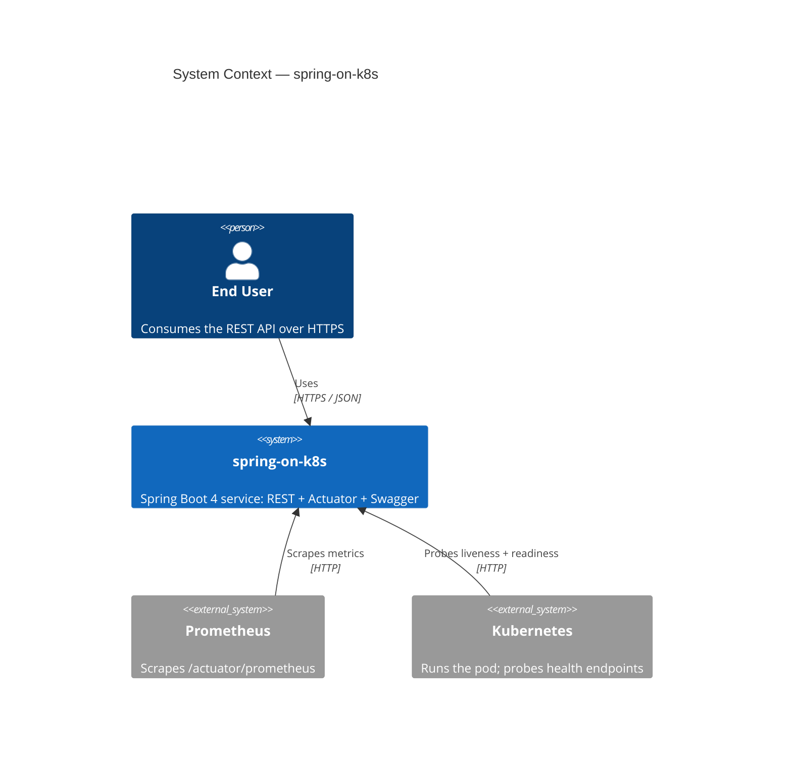
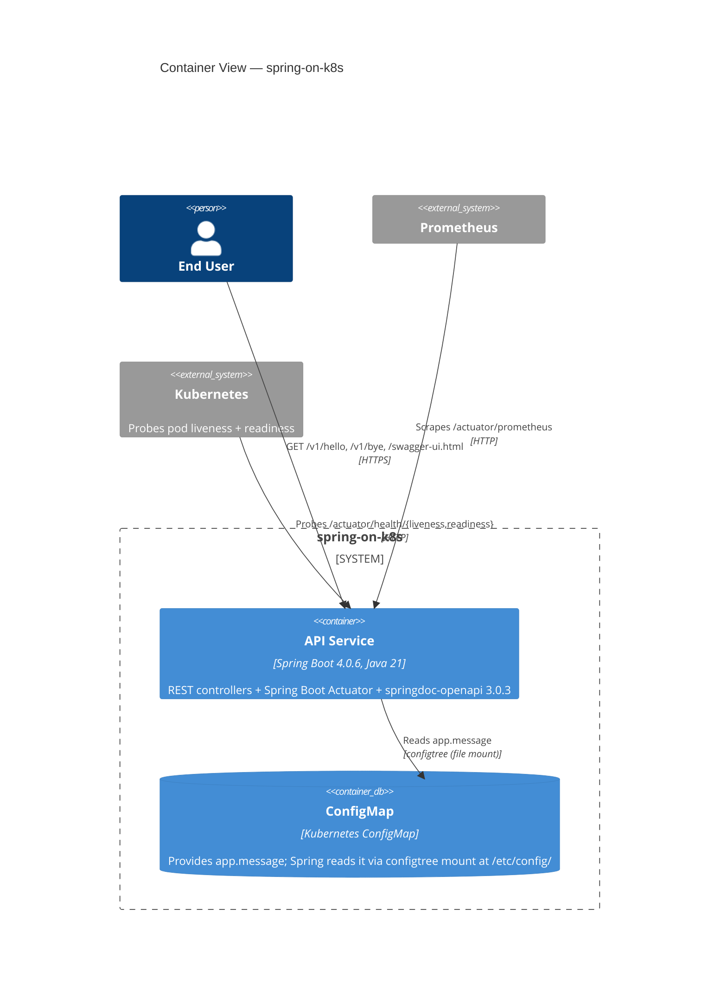

[](https://github.com/AndriyKalashnykov/spring-on-k8s/actions/workflows/ci.yml)
[](https://hits.sh/github.com/AndriyKalashnykov/spring-on-k8s/)
[](https://opensource.org/licenses/MIT)
[](https://app.renovatebot.com/dashboard#github/AndriyKalashnykov/spring-on-k8s)

# Running Spring Boot app on Kubernetes

Spring Boot 4 reference service for Kubernetes deployment. Exposes REST endpoints (`/v1/hello`, `/v1/bye`), Swagger UI, Prometheus metrics via Spring Boot Actuator, and K8s liveness / readiness probes. Application configuration is overridden at runtime by a mounted `ConfigMap` via Spring's `configtree:` property source.


```mermaid
C4Context
  title System Context — spring-on-k8s

  Person(user, "End User", "Consumes the REST API over HTTPS")
  System(sys, "spring-on-k8s", "Spring Boot 4 service: REST + Actuator + Swagger")
  System_Ext(prom, "Prometheus", "Scrapes /actuator/prometheus")
  System_Ext(k8s, "Kubernetes", "Runs the pod; probes health endpoints")

  Rel(user, sys, "Uses", "HTTPS / JSON")
  Rel(prom, sys, "Scrapes metrics", "HTTP")
  Rel(k8s, sys, "Probes liveness + readiness", "HTTP")

  UpdateLayoutConfig($c4ShapeInRow="2")
```

| Component | Technology |
|-----------|-----------|
| Language | Java 21 (source + target + runtime) |
| Framework | Spring Boot 4.0.6 |
| API style | REST + OpenAPI via [springdoc-openapi](https://springdoc.org/) 3.0.3 |
| Metrics | [Micrometer](https://micrometer.io/) + Prometheus registry |
| Build | Maven 3.9.15 |
| Container | Multi-stage Dockerfile, distroless runtime, non-root user |
| Orchestration | Kubernetes, deployed via [Carvel](https://carvel.dev/) (`ytt` + `kapp`) |
| Local K8s | [KinD](https://kind.sigs.k8s.io/) + [cloud-provider-kind](https://github.com/kubernetes-sigs/cloud-provider-kind) (test target node image: `kindest/node:v1.35.0`) |
| CI/CD | GitHub Actions (per-concern jobs; details in [CI/CD section](#cicd)) |
| Format | [google-java-format](https://github.com/google/google-java-format) |
| Static analysis | Checkstyle (Java), hadolint (Dockerfile), actionlint (workflows) |
| Secret scan | gitleaks |
| Vuln scan | Trivy (filesystem + image + IaC), OWASP dependency-check (NVD) |
| Dep management | Renovate (automerge minor/patch, 3-day buffer on majors) |

## Quick Start

```bash
make deps          # installs mise + all tools pinned in .mise.toml
make build         # build the project
make test          # run tests
make run           # start at http://localhost:8080
```

## Prerequisites

`make deps` installs [mise](https://mise.jdx.dev/) (no root required, to `~/.local/bin`), then runs `mise install` to fetch every pinned tool from `.mise.toml` — Java, Maven, Node, kubectl, kind, act, hadolint, gitleaks, trivy, actionlint, shellcheck. The host only needs the items marked **system** below.

| Tool | Version | Source | Purpose |
|------|---------|--------|---------|
| [GNU Make](https://www.gnu.org/software/make/) | 3.81+ | **system** | Build orchestration |
| [Docker](https://www.docker.com/) | latest | **system** | Container image builds, KinD nodes, Mermaid / Trivy containers |
| [Git](https://git-scm.com/) | latest | **system** | Version control |
| [mise](https://mise.jdx.dev/) | latest | auto-installed by `make deps` | Manages every tool pinned in `.mise.toml` |
| Java (Temurin) | 21 | mise | Build + runtime |
| Maven | 3.9.15 | mise | Dependency management |
| Node | 24 | mise | Renovate validation (`renovate-validate`) |
| kubectl, kind | pinned in `.mise.toml` | mise | Local K8s cluster for `make e2e` |
| act, hadolint, gitleaks, trivy, actionlint, shellcheck | pinned in `.mise.toml` | mise | Workflow-local CI, linters, security scanners |
| [Carvel](https://carvel.dev/) | latest | optional | `ytt` + `kapp` for production K8s deploy |

Install everything:

```bash
make deps
```

## Architecture

### Container view


```mermaid
C4Container
  title Container View — spring-on-k8s

  Person(user, "End User")
  System_Ext(prom, "Prometheus")
  System_Ext(k8s, "Kubernetes", "Probes pod liveness + readiness")

  System_Boundary(sys, "spring-on-k8s") {
    Container(api, "API Service", "Spring Boot 4.0.6, Java 21", "REST controllers + Spring Boot Actuator + springdoc-openapi 3.0.3")
    ContainerDb(cm, "ConfigMap", "Kubernetes ConfigMap", "Provides app.message; Spring reads it via configtree mount at /etc/config/")
  }

  Rel(user, api, "GET /v1/hello, /v1/bye, /swagger-ui.html", "HTTPS")
  Rel(api, cm, "Reads app.message", "configtree (file mount)")
  Rel(prom, api, "Scrapes /actuator/prometheus", "HTTP")
  Rel(k8s, api, "Probes /actuator/health/{liveness,readiness}", "HTTP")
```

- **API Service** — single Spring Boot process, Micrometer exports Prometheus metrics, Actuator backs the K8s probes (`/actuator/health/liveness`, `/actuator/health/readiness`)
- **ConfigMap** — cluster-side K8s resource, mounted as a volume at `/etc/config/`; the env `SPRING_CONFIG_IMPORT=configtree:/etc/config/` tells Spring to read each file as a property (default `Hello world!` → ConfigMap overrides to `Hello Kubernetes!`)
- **Prometheus** — external scrape target, no code changes required; the endpoint is enabled via `management.endpoints.web.exposure.include`

### Deployment


```mermaid
C4Deployment
  title Deployment — Kubernetes (via Carvel ytt + kapp)

  Deployment_Node(cluster, "Kubernetes Cluster") {
    Deployment_Node(ns, "Namespace: spring-on-k8s") {
      Deployment_Node(pod, "Pod (Deployment replicas=1)") {
        Container(api, "app container", "ghcr.io/andriykalashnykov/spring-on-k8s, distroless Java 21, non-root")
      }
      Container(svc, "Service: app", "LoadBalancer 80 → 8080")
      ContainerDb(cmres, "ConfigMap: config", "app.message = Hello Kubernetes!")
    }
  }

  Rel(svc, api, "Routes to :8080", "TCP")
  Rel(cmres, api, "Mounted at /etc/config/", "volume")
```

- **Deployment** — 1 replica, 1 Gi memory limit, liveness+readiness probes point at Actuator
- **Service** — LoadBalancer; locally served by `cloud-provider-kind` in the `make e2e` KinD stack (host-side controller on the `kind` Docker network), cloud-provided in production
- **ConfigMap** — deployed alongside the Deployment; edits to `k8s/cm.yml` propagate via `kapp deploy` and trigger a pod rollout (config source-of-truth lives in git, not in `kubectl edit`)

Sources: diagrams are inline Mermaid in this README — no build step; GitHub renders them natively. Lint with `make mermaid-lint` (uses the same `minlag/mermaid-cli` engine GitHub uses, so what parses locally renders on the homepage).

## API

| Path | Description |
|------|-------------|
| `GET /` | Hardcoded greeting (`Hello world`) |
| `GET /v1/hello` | Returns `${app.message}` (default: `Hello world!`; overridden by ConfigMap to `Hello Kubernetes!`) |
| `GET /v1/bye` | Returns `${app.message}` |
| `GET /actuator/health` | Aggregate health |
| `GET /actuator/health/liveness` | K8s liveness probe endpoint |
| `GET /actuator/health/readiness` | K8s readiness probe endpoint |
| `GET /actuator/prometheus` | Prometheus scrape target |
| `GET /swagger-ui.html` | OpenAPI / Swagger UI |
| `GET /v3/api-docs` | OpenAPI JSON |

### Swagger UI


## Build & Package

A multi-stage [Dockerfile](./Dockerfile) builds a distroless runtime image with a non-root user and Spring Boot JAR layering.

```bash
make image-build                                         # build
make image-run                                           # run at http://localhost:8080
make image-push                                          # push to registry
```

Buildpacks alternative (Paketo) — builds the image locally without pushing:

```bash
mvn clean spring-boot:build-image \
  -Djava.version=21 \
  -Dimage.publish=false \
  -Dimage.name="andriykalashnykov/spring-on-k8s:latest"
```

To push, configure registry credentials in `~/.m2/settings.xml` under `<servers>` and run with `-Dimage.publish=true`. Do not pass passwords on the Maven command line — `-D` flag values are visible in `ps -ef` / `/proc/<pid>/cmdline` for the JVM lifetime.

Scan with Docker Scout:

```bash
docker scout cves ghcr.io/andriykalashnykov/spring-on-k8s:latest
```

## Deployment

### Production path (Carvel)

```bash
ytt -f ./k8s | kapp deploy -y --into-ns spring-on-k8s -a spring-on-k8s -f-
```

Wait for the `LoadBalancer` Service to receive an external IP:

```bash
kubectl -n spring-on-k8s get svc app

NAME   TYPE           CLUSTER-IP     EXTERNAL-IP    PORT(S)        AGE
app    LoadBalancer   10.96.10.42    192.0.2.10     80:31633/TCP   90s
```

Verify the ConfigMap override is applied:

```bash
curl "http://$(kubectl -n spring-on-k8s get svc app -o jsonpath='{.status.loadBalancer.ingress[0].ip}')/v1/hello"
Hello Kubernetes!
```

Undeploy:

```bash
kapp delete -a spring-on-k8s --yes
```

### Local E2E path (KinD + cloud-provider-kind)

```bash
make e2e                 # spins up cluster, deploys, runs assertions, tears down
```

Or step by step for debugging:

```bash
make kind-up             # create cluster + cloud-provider-kind + deploy
kubectl -n spring-on-k8s get svc app
# run manual curls against the assigned LoadBalancer IP
make kind-down           # tear down
```

## Available Make Targets

Run `make help` to see all available targets.

### Build & Run

| Target | Description |
|--------|-------------|
| `make build` | Build project (skips tests) |
| `make run` | Run locally at `http://localhost:8080` |
| `make clean` | Clean Maven build artifacts |

### Testing (three layers)

| Target | Description | Runtime | Discovery |
|--------|-------------|---------|-----------|
| `make test` | Unit tests (Surefire, excludes `*IT.java`) | seconds | `**/*Test.java`, `**/*Tests.java` |
| `make integration-test` | In-process integration tests via `@SpringBootTest(RANDOM_PORT)` + real Actuator/Springdoc | ~5s | `**/*IT.java` (Failsafe, `integration-test` Maven profile) |
| `make e2e` | Full-stack end-to-end against KinD + cloud-provider-kind; asserts ConfigMap override + LB wiring + negative case | ~3–5 min | `scripts/e2e-test.sh` |

### Code Quality & Security

| Target | Description |
|--------|-------------|
| `make format` | Format Java sources with google-java-format (writes changes) |
| `make format-check` | Verify Java sources are formatted (no changes) |
| `make lint` | Checkstyle + hadolint + compiler warnings-as-errors |
| `make secrets` | gitleaks scan of working tree |
| `make secrets-history` | gitleaks full git history audit (slow) |
| `make trivy-fs` | Trivy filesystem scan (vulns, secrets, misconfigs) |
| `make trivy-config` | Trivy scan of K8s manifests |
| `make lint-ci` | actionlint on `.github/workflows/` |
| `make cve-check` | OWASP dependency-check (fast with `NVD_API_KEY`) |
| `make vulncheck` | Alias for `cve-check` (portfolio-standard target name) |
| `make deps-prune` | Report unused/undeclared Maven dependencies |
| `make deps-prune-check` | Fail if unused/undeclared Maven dependencies found |
| `make static-check` | Composite gate: format-check + lint + secrets + trivy-fs + trivy-config + lint-ci + mermaid-lint + deps-prune-check |

### Docker

| Target | Description |
|--------|-------------|
| `make image-build` | Build Docker image (`$(DOCKER_IMAGE):$(DOCKER_TAG)`) |
| `make image-run` | Run Docker container |
| `make image-stop` | Stop Docker container |
| `make image-push` | Push Docker image to registry |
| `make docker-smoke-test` | Boot the locally-built `spring-on-k8s:ci-scan` image and verify `/actuator/health/readiness` reports `UP` within 60s (mirrors CI Gate 3) |
| `make dast` | Build image, boot, run OWASP ZAP baseline scan, cleanup (local equivalent of the CI `docker` job's DAST steps) |
| `make dast-scan` | Run ZAP baseline against `http://localhost:8080` (assumes container is already running) |

### Kubernetes (KinD)

| Target | Description |
|--------|-------------|
| `make kind-up` | Bring the full stack up: create cluster → start cloud-provider-kind → load image → deploy |
| `make kind-down` | Tear the cluster down |
| `make kind-create` | Create KinD cluster (granular) |
| `make kind-setup` | Start cloud-provider-kind for `LoadBalancer` IP allocation (granular) |
| `make kind-load` | Load local Docker image into KinD (granular) |
| `make kind-deploy` | Apply K8s manifests to the KinD cluster (granular) |
| `make kind-undeploy` | Remove the app from the cluster (granular) |
| `make kind-destroy` | Delete the KinD cluster (granular) |

> The `make e2e` target lives in the [Testing](#testing-three-layers) group above — it depends on `make kind-up` and tears down via `make kind-down`.

### CI

| Target | Description |
|--------|-------------|
| `make ci` | Full local CI: deps → static-check → test → integration-test → build (`format-check` runs transitively inside `static-check`) |
| `make ci-run` | Run a subset of the GitHub Actions workflow locally via [act](https://github.com/nektos/act) — covers `static-check`, `build`, `test`, `integration-test`, `docker`. Skips `e2e` (KinD-in-act flakes), `cve-check` (tag/schedule-gated, slow without `NVD_API_KEY`), and `ci-pass` (meta). DAST steps inside `docker` are skipped under act (`vars.ACT == 'true'`) — run `make dast` directly to cover that ground |
| `make ci-run-tag` | Simulate a tag-push event under act (exercises the tag-gated parts of the `docker` job; cosign signing fails — expected, no OIDC under act). DAST steps in `docker` are skipped under act |

### Utilities

| Target | Description |
|--------|-------------|
| `make help` | List all available targets |
| `make deps` | Install mise + all tools pinned in `.mise.toml` (idempotent) |
| `make deps-check` | Show installed tool versions from mise |
| `make deps-gjf` | Download google-java-format JAR (not managed by mise — JAR download only) |
| `make upgrade` | Show available Maven dependency updates (dry-run) |
| `make upgrade-apply` | Apply latest Maven releases (prompts, mutates `pom.xml`) |
| `make release VERSION=x.y.z` | Create a semver release tag |
| `make renovate-bootstrap` | Install Node via mise so `renovate-validate` can run |
| `make renovate-validate` | Validate Renovate configuration locally |

## CI/CD

GitHub Actions runs on every push to `main`, tags `v*`, and pull requests. Path filtering is done **inside** the workflow by a `changes` detector job (using `dorny/paths-filter`), not at the trigger level. Trigger-level `paths-ignore` deadlocks under Repository Rulesets that require a `ci-pass` status check — a doc-only change produces no run, so `ci-pass` reports "expected, not received" indefinitely. With in-workflow filtering, doc-only PRs still create a workflow run; heavy jobs are skipped, and `ci-pass` aggregates the skips into a green status so the merge gate passes.

Every job that needs Java, Maven, or any CLI tool pinned in `.mise.toml` uses `jdx/mise-action` as the single toolchain-provisioning step. `actions/cache` handles the Maven repository (`~/.m2/repository`) separately.

### CI workflow (`.github/workflows/ci.yml`)

| Job | Triggers | Steps |
|-----|----------|-------|
| **changes** | push, PR, tags, schedule, manual | `dorny/paths-filter` — sets `code=true` on any non-doc file change; forced to `true` on tag push, schedule, and `workflow_dispatch` |
| **static-check** | needs: changes (gated on `code == 'true'`) | `make static-check` (format-check, Checkstyle, hadolint, compiler warnings, gitleaks, Trivy fs + config, actionlint, mermaid-lint, deps-prune-check) |
| **build** | needs: changes, static-check | `make build` |
| **test** | needs: changes, static-check | `make test` — unit layer (Surefire) |
| **integration-test** | needs: changes, static-check | `make integration-test` — in-process integration via Failsafe profile |
| **e2e** | needs: changes, build, test | `make e2e` — KinD + cloud-provider-kind, asserts ConfigMap override + LB wiring |
| **cve-check** | tags, weekly Monday 04:00 UTC, manual dispatch (needs: changes, static-check) | `make cve-check` — OWASP dependency-check (fast with `NVD_API_KEY` secret; tag-gated so every release is scanned) |
| **docker** | every push (needs: changes, static-check, build, test, cve-check) | Pattern A hardening, single-arch (`linux/amd64`). Gates 1–3 (build → Trivy image scan blocking CRITICAL/HIGH with `scanners=vuln,secret,misconfig` → smoke test on `/actuator/health/readiness` via `make docker-smoke-test`) run on every push. **DAST** (OWASP ZAP baseline against the running smoke container) runs inline after Gate 3 — ZAP `-I` warn-only mode (only FAIL blocks), WARN findings captured in the uploaded `zap-baseline-report` artifact, ZAP image (~3.4 GB) cached via `actions/cache`, all DAST steps skipped under act (`vars.ACT == 'true'`). Gate 4 (amd64 publish build) tag-gated. Gate 5 (cosign keyless OIDC sign) tag-gated. `provenance: false` + `sbom: false` keep the image index clean. Gates on `cve-check` via `if: !failure() && !cancelled()` so a real CVE on tag push blocks publish, but `cve-check` being `skipped` on regular pushes does not skip docker |
| **ci-pass** | always (needs: every upstream job) | Single stable branch-protection gate. Aggregates `failure` and `cancelled` results across upstream jobs; treats `skipped` as PASS — this is what makes doc-only PRs mergeable without disabling the required check |

### Cleanup workflow (`.github/workflows/cleanup-runs.yml`)

| Job | Triggers | Steps |
|-----|----------|-------|
| **cleanup-runs** | weekly (Sunday 00:00 UTC), manual | Prune old workflow runs (retain 7 days, keep 5 minimum) |
| **cleanup-caches** | weekly (Sunday 00:00 UTC), manual | Delete actions caches scoped to refs that no longer exist (deleted PR branches), reclaiming room against the 10 GB repo cache limit |

### Pre-push image hardening

The `docker` job runs the following gates **before** any image is pushed to GHCR. Any failure blocks the release.

| # | Gate | Catches | Tool |
|---|------|---------|------|
| 1 | Build local single-arch image | Build regressions on the runner architecture | `docker/build-push-action` with `load: true` (`cache-from`/`cache-to` of `type=gha` for sub-10s rebuilds) |
| 2 | **Trivy image scan** (CRITICAL/HIGH blocking, `scanners=vuln,secret,misconfig`) | CVEs in the base image, OS packages, build layers; secrets baked into layers; Dockerfile misconfigs | `aquasecurity/trivy-action` with `image-ref:` |
| 3 | **Smoke test** | Image boots correctly on its own — Spring Boot reaches `/actuator/health/readiness` UP within 60s | `make docker-smoke-test` |
| 3a | **OWASP ZAP baseline scan** (DAST) | Missing security headers, server-info leaks, XSS protection misconfigs, cookie flags — scans the running smoke container | `make dast-scan` ([OWASP ZAP](https://www.zaproxy.org/) `-I` warn-only, report uploaded as `zap-baseline-report` artifact, 30-day retention; ZAP image cached via `actions/cache`; all DAST steps skipped under act) |
| 4 | Build + push (`linux/amd64`) | Publishes the production image to GHCR; push only on `v*` tags | `docker/build-push-action` |
| 5 | **Cosign keyless OIDC signing** | Sigstore signature on the manifest digest, tag-gated | `sigstore/cosign-installer` + `cosign sign` |

Buildkit in-manifest attestations (`provenance` + `sbom`) are deliberately disabled (`provenance: false`, `sbom: false`) so the OCI image index stays free of `unknown/unknown` platform entries — that lets the GHCR Packages UI render the "OS / Arch" tab for the multi-arch manifest. Cosign keyless signing still provides the Sigstore signature for supply-chain verification, which is sufficient for almost all consumers.

Verify a published image's signature with:

```bash
cosign verify ghcr.io/andriykalashnykov/spring-on-k8s:<tag> \
  --certificate-identity-regexp 'https://github\.com/AndriyKalashnykov/spring-on-k8s/.+' \
  --certificate-oidc-issuer https://token.actions.githubusercontent.com
```

### Required Secrets and Variables

| Name | Type | Used by | How to obtain |
|------|------|---------|---------------|
| `GITHUB_TOKEN` | Secret (default) | `docker` job (GHCR push, via `${{ secrets.GITHUB_TOKEN }}`); `cleanup-runs` + `cleanup-caches` jobs use the same token via the `${{ github.token }}` context expression | Provided automatically by GitHub Actions |
| `NVD_API_KEY` | Secret (recommended) | `cve-check` job (NVD data source) | Free API key from [NIST NVD](https://nvd.nist.gov/developers/request-an-api-key). Without it, NVD uses an anonymous slow path (~15 min); with it, ~1 min |

Set via **Settings → Secrets and variables → Actions → New repository secret**. The same env var works locally (`export NVD_API_KEY=...`) for `make cve-check` runs.

OSS Index (Sonatype) is disabled for this project — Spring Boot's ~173-batch dependency tree exceeds free-tier rate limits even with authentication (server returns HTTP 401, which OWASP dep-check classifies as permanent and does not soft-fail). NVD is the sole CVE data source. If you want OSS Index back, upgrade to a paid Sonatype account and remove the `-DossIndexAnalyzerEnabled=false` flag from `make cve-check`.

### Post-release manifest verification

After the first `docker` job publishes the image, run all three checks before declaring the release good:

```bash
# 1. Manifest: must list linux/amd64 only, with ZERO Platform: unknown/unknown entries
docker buildx imagetools inspect ghcr.io/andriykalashnykov/spring-on-k8s:<tag>

# 2. GHCR Packages UI: https://github.com/AndriyKalashnykov/spring-on-k8s/pkgs/container/spring-on-k8s

# 3. Cosign signature (verify command in the Pre-push image hardening section above)
cosign verify ghcr.io/andriykalashnykov/spring-on-k8s:<tag> \
  --certificate-identity-regexp 'https://github\.com/AndriyKalashnykov/spring-on-k8s/.+' \
  --certificate-oidc-issuer https://token.actions.githubusercontent.com
```

If `imagetools inspect` shows any `Platform: unknown/unknown` entry, buildkit attestations have leaked in — check that `provenance: false` and `sbom: false` are still set on the `Build and push` step of the `docker` job.

[Renovate](https://docs.renovatebot.com/) keeps dependencies up to date with platform automerge enabled for minor/patch (3-day release-age buffer on majors).

## Contributing

Contributions welcome — open a PR.
