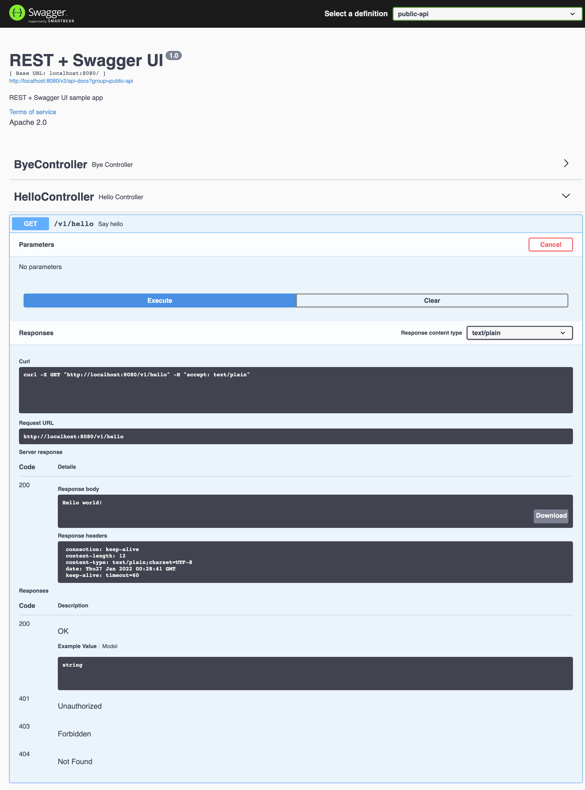
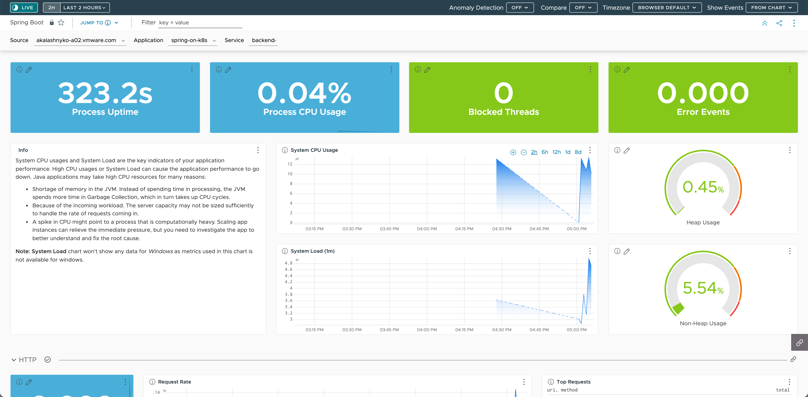
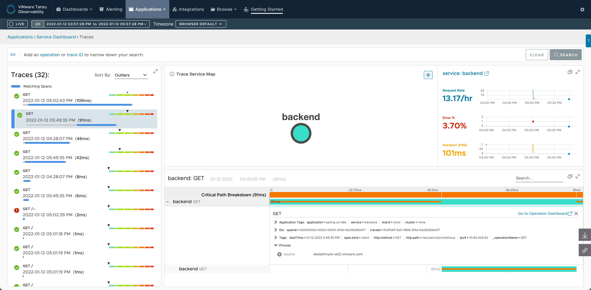

[](https://github.com/AndriyKalashnykov/spring-on-k8s/actions/workflows/ci.yml)
[](https://hits.sh/github.com/AndriyKalashnykov/spring-on-k8s/)
[](https://opensource.org/licenses/MIT)
[](https://app.renovatebot.com/dashboard#github/AndriyKalashnykov/spring-on-k8s)

# Running Spring Boot app on Kubernetes

Spring Boot 4.0.2 application demonstrating how to run on Kubernetes. Exposes REST endpoints (`/v1/hello`, `/v1/bye`) with Swagger UI, Prometheus metrics via Actuator, and K8s health probes. Built with Java 21 and Maven.

## Quick Start

```bash
make deps          # verify required tools
make build         # build the project
make test          # run tests
make run           # start at http://localhost:8080
```

## Prerequisites

| Tool | Version | Purpose |
|------|---------|---------|
| [GNU Make](https://www.gnu.org/software/make/) | 3.81+ | Build orchestration |
| [JDK](https://adoptium.net/) | 21+ | Java runtime and compiler |
| [Maven](https://maven.apache.org/) | 3.9+ | Build and dependency management |
| [Docker](https://www.docker.com/) | latest | Container image builds |
| [Git](https://git-scm.com/) | 2.0+ | Version control |
| [SDKMAN](https://sdkman.io/) | latest | Java/Maven version management (optional) |
| [kubectl](https://kubernetes.io/docs/tasks/tools/) | latest | Kubernetes deployment (optional) |
| [Carvel](https://carvel.dev/) | latest | K8s templating and deployment (optional) |

Install all required dependencies:

```bash
make deps
```

Install SDKMAN-managed Java/Maven versions:

```bash
make deps-check
```

## Available Make Targets

Run `make help` to see all available targets.

### Build & Run

| Target | Description |
|--------|-------------|
| `make build` | Build project |
| `make test` | Run project tests |
| `make run` | Run project |
| `make clean` | Cleanup |

### Code Quality

| Target | Description |
|--------|-------------|
| `make lint` | Run code style checks |
| `make upgrade` | Upgrade Maven dependencies |

### Docker

| Target | Description |
|--------|-------------|
| `make image-build` | Build Docker image |
| `make image-run` | Run Docker container |
| `make image-stop` | Stop Docker container |

### CI

| Target | Description |
|--------|-------------|
| `make ci` | Run full CI pipeline (deps, build, test, lint) |
| `make ci-run` | Run GitHub Actions workflow locally using [act](https://github.com/nektos/act) |

### Utilities

| Target | Description |
|--------|-------------|
| `make deps` | Check required tools (java, mvn, docker, git) |
| `make deps-check` | Check SDKMAN and install Java/Maven |
| `make deps-act` | Install act for local CI (GitHub Actions) |
| `make env-check` | Check installed tools |
| `make release VERSION=x.y.z` | Create a release |
| `make renovate-bootstrap` | Install nvm and npm for Renovate |
| `make renovate-validate` | Validate Renovate configuration |

## REST API

The app has two REST controllers:

```java
@RestController
@RequestMapping("/v1")
class HelloController {
    @Value("${app.message:Hello world!}")
    private String message;

    @GetMapping(value = "/hello", produces = MediaType.TEXT_PLAIN_VALUE)
    String hello() {
        return message;
    }
}
```

```java
@RestController
@RequestMapping("/v1")
class ByeController {
    @Value("${app.message:Bye world!}")
    private String message;

    @GetMapping(value = "/bye", produces = MediaType.TEXT_PLAIN_VALUE)
    String bye() {
        return message;
    }
}
```

### Endpoints

```bash
curl -w '\n' localhost:8080/v1/hello
Hello world!

curl -w '\n' localhost:8080/v1/bye
Bye world!
```

### Health & Metrics

```bash
curl -s http://localhost:8080/actuator | jq .

{
  "_links": {
    "self": {
      "href": "http://localhost:8080/actuator",
      "templated": false
    },
    "health": {
      "href": "http://localhost:8080/actuator/health",
      "templated": false
    },
    "health-path": {
      "href": "http://localhost:8080/actuator/health/{*path}",
      "templated": true
    },
    "prometheus": {
      "href": "http://localhost:8080/actuator/prometheus",
      "templated": false
    }
  }
}
```

### Swagger UI

Open [`http://localhost:8080/swagger-ui.html`](http://localhost:8080/swagger-ui.html)



## Creating a Docker image

### Buildpacks

Use [Cloud Native Buildpacks](https://buildpacks.io) to build & push your Docker image:

```bash
export DOCKER_LOGIN=andriykalashnykov
export DOCKER_PWD=YOUR-REGISTRY-PASSWORD
mvn clean spring-boot:build-image -Djava.version=21 -Dimage.publish=false -Dimage.name=andriykalashnykov/spring-on-k8s:latest -Ddocker.publishRegistry.username=${DOCKER_LOGIN} -Ddocker.publishRegistry.password=${DOCKER_PWD}
```

### Docker

A multi-stage [Dockerfile](./Dockerfile) is included (non-root, JAR layers, distroless runtime image).

```bash
make image-build
```

Or directly with Docker:

```bash
docker build -t andriykalashnykov/spring-on-k8s:latest --build-arg JDK_VENDOR=eclipse-temurin --build-arg JDK_VERSION=21 .
```

Push to your Docker registry:

```bash
docker push andriykalashnykov/spring-on-k8s:latest
```

## Scanning for vulnerabilities

```bash
docker scout cves andriykalashnykov/spring-on-k8s:latest
```

### Using workaround to mitigate `Log4j 2 CVE-2021-44228` by creating Docker image with [custom buildpack](https://github.com/alexandreroman/cve-2021-44228-workaround-buildpack)

```bash
pack build andriykalashnykov/spring-on-k8s:latest  -b ghcr.io/alexandreroman/cve-2021-44228-workaround-buildpack -b paketo-buildpacks/java --builder paketobuildpacks/builder:buildpackless-base
```

## Running Docker image

```bash
make image-run
```

Or directly:

```bash
docker run --rm -p 8080:8080 andriykalashnykov/spring-on-k8s:latest
```

## Deploying application to Kubernetes

This project includes Kubernetes descriptors, so you can easily deploy
this app to your favorite K8s cluster:

```bash
ytt -f ./k8s | kapp deploy -y --into-ns spring-on-k8s -a spring-on-k8s -f-
```

Using this command, monitor the allocated IP address for this app:
```bash
kubectl -n spring-on-k8s get svc

NAME     TYPE           CLUSTER-IP       EXTERNAL-IP     PORT(S)        AGE
app-lb   LoadBalancer   xx.100.200.204   xx.205.141.26   80:31633/TCP   90s
```

At some point, you should see an IP address under the column `EXTERNAL-IP`.

If you hit this address, you will get a greeting message from the app:

```bash
curl $(kubectl -n spring-on-k8s get svc app | sed -n '2 p' | awk '{print $4}')

Hello Kubernetes!
```

## Undeploy application from Kubernetes

```bash
kapp delete -a spring-on-k8s --yes
```

## Configure VMware Tanzu Observability (Wavefront)

> **Note:** The Wavefront integration below references Spring Cloud Sleuth and older dependency versions. For Spring Boot 3+, use [Micrometer Tracing](https://micrometer.io/docs/tracing) instead of Sleuth.

Wavefront for Spring Boot allows you to quickly configure your
environment, so Spring Boot components send metrics, histograms,
and traces/spans to the Wavefront service, for more details see
how to [examine Spring Boot data in Wavefront dashboards and charts](https://docs.wavefront.com/wavefront_springboot.html#prerequisites-for-wavefront-spring-boot-starter)

### Sending Data From Spring Boot Into Wavefront

You can send data from your Spring Boot applications into Wavefront using the Wavefront for Spring Boot Starter
(all users) or the Wavefront Spring Boot integration (Wavefront customers and trial users).

* **Freemium** :  All users can run the Spring Boot Starter with the default settings to view their data in the Wavefront Freemium instance. Certain limitations apply, for example, alerts are not available, but you don't have to sign up.
* **Wavefront Customer or Trial User** : Wavefront customers or trial users can modify the default Wavefront Spring Boot Starter to send data to their cluster. [You can sign up for a free 30-day trial here](https://tanzu.vmware.com/observability)

#### Sending Data From Spring Boot Into Wavefront - Freemium

To configure `Freemium` modify [application.yml](./src/main/resources/application.yml)
by specifying `freemium-account : true`, setting `name` of the overarching application and current `service` name in particular.

```yaml
wavefront:
  freemium-account: true
  application:
    name: spring-on-k8s
    service: backend
```

#### Sending Data From Spring Boot Into Wavefront - Wavefront Customer or Trial User

To configure `Wavefront Customer or Trial User` modify [application.yml](./src/main/resources/application.yml)
by specifying `freemium-account : false` and providing `uri` and `api-token` of the Wavefront instance.

```yaml
wavefront:
  freemium-account: false
  application:
    name: spring-on-k8s
    service: backend

management:
  metrics:
    export:
      wavefront:
        api-token: "$API_Token"
        uri: "$wavefront_instance"
```

We also need to configure Wavefront dependencies based on how you want to send data to Wavefront. Two options are available
`Spring Cloud Sleuth` and `OpenTracing`.

#### Sending data to `Wavefront` with `Spring Cloud Sleuth`

Modify Maven project file [`pom.xml`](./pom.xml)

```xml
<dependencyManagement>
  <dependencies>
    <dependency>
      <groupId>com.wavefront</groupId>
      <artifactId>wavefront-spring-boot-bom</artifactId>
      <version>2.2.0</version>
      <type>pom</type>
      <scope>import</scope>
    </dependency>

    <dependency>
      <groupId>org.springframework.cloud</groupId>
      <artifactId>spring-cloud-dependencies</artifactId>
      <version>2020.0.4</version>
      <type>pom</type>
      <scope>import</scope>
    </dependency>
  </dependencies>
</dependencyManagement>

<dependencies>
  <dependency>
    <groupId>com.wavefront</groupId>
    <artifactId>wavefront-spring-boot-starter</artifactId>
  </dependency>
  <dependency>
    <groupId>org.springframework.cloud</groupId>
    <artifactId>spring-cloud-starter-sleuth</artifactId>
  </dependency>
</dependencies>
```

#### Sending data to `Wavefront` with `OpenTracing`

Modify Maven project file [`pom.xml`](./pom.xml)

```xml
<dependencyManagement>
  <dependencies>
    <dependency>
      <groupId>com.wavefront</groupId>
      <artifactId>wavefront-spring-boot-bom</artifactId>
      <version>2.2.0</version>
      <type>pom</type>
      <scope>import</scope>
    </dependency>
  </dependencies>
</dependencyManagement>

<dependencies>
  <dependency>
    <groupId>com.wavefront</groupId>
    <artifactId>wavefront-spring-boot-starter</artifactId>
  </dependency>

  <dependency>
    <groupId>io.opentracing.contrib</groupId>
    <artifactId>opentracing-spring-cloud-starter</artifactId>
    <version>0.5.9</version>
  </dependency>
</dependencies>
```





## Application Accelerator for VMware Tanzu

[Creating Application Accelerators](https://docs.vmware.com/en/Application-Accelerator-for-VMware-Tanzu/1.0/acc-docs/GUID-creating-accelerators-index.html)
and [Creating an accelerator.yaml](https://docs.vmware.com/en/Application-Accelerator-for-VMware-Tanzu/1.0/acc-docs/GUID-creating-accelerators-accelerator-yaml.html)

### Publishing the accelerator

#### With kubectl

```bash
mkdir -p ~/projects/; cd ~/projects/
git clone git@github.com:AndriyKalashnykov/spring-on-k8s.git

kubectl apply -f  ~/projects/spring-on-k8s/k8s-resource.yaml --namespace accelerator-system
```

#### With Tanzu CLI

```bash
tanzu acc create spring-on-k8s --kubeconfig $HOME/.kube/config  --git-repository https://github.com/AndriyKalashnykov/spring-on-k8s.git --git-branch main
```

### Deleting the accelerator

#### With kubectl
```bash
kubectl delete -f  ~/projects/spring-on-k8s/k8s-resource.yaml --namespace accelerator-system
```

#### With Tanzu CLI

```bash
tanzu acc delete spring-on-k8s --kubeconfig $HOME/.kube/config
```

## CI/CD

GitHub Actions runs on every push to `main`, tags `v*`, and pull requests.

| Job | Triggers | Steps |
|-----|----------|-------|
| **ci** | push, PR, tags | Build, Test, Lint |
| **cleanup** | weekly (Sunday) | Delete old workflow runs (retain 7 days, keep 5 minimum) |

[Renovate](https://docs.renovatebot.com/) keeps dependencies up to date.

## Contribute

Contributions are always welcome!

Feel free to open issues & send PR.
